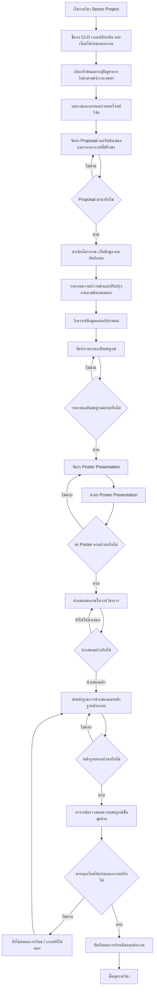

# Flow กระบวนการ Senior Project ก่อนออกเกรด

> **หลักการสำคัญ:** นักศึกษาต้องดำเนินกระบวนการ Senior Project ตามปกติให้ครบถ้วน และต้องมี **2 เงื่อนไขเพิ่มเติมก่อนออกเกรด** ได้แก่  
> 1) นำส่ง **Poster Presentation**  
> 2) นำเสนอผลงานใน **งานวิชาการ** ทั้งแบบ **ภายในส่วนงาน** หรือ **ภายนอกส่วนงาน**  
>
> หากยังไม่ดำเนินการครบตามเงื่อนไขดังกล่าว ให้ถือว่า **ยังไม่พร้อมส่งผลการเรียน / เกรดยังไม่ออก** จนกว่านักศึกษาจะส่งหลักฐานครบถ้วน

---

## 1. วัตถุประสงค์ของ Flow

Flow นี้จัดทำขึ้นเพื่อใช้ชี้แจงนักศึกษาในรายวิชา Senior Project ให้เข้าใจขั้นตอนทั้งหมดก่อนสิ้นสุดรายวิชา โดยเน้นว่า นอกจากการทำโครงงานตามกระบวนการปกติแล้ว นักศึกษาจะต้องแสดงหลักฐานการเผยแพร่ผลงานในรูปแบบ Poster และการนำเสนอในเวทีวิชาการ เพื่อยืนยันว่าผลงานมีความสมบูรณ์และผ่านกระบวนการสื่อสารทางวิชาการแล้ว

---

## 2. เงื่อนไขสำคัญก่อนออกเกรด

| ลำดับ | เงื่อนไขที่ต้องดำเนินการ | รายละเอียด | สถานะต่อการออกเกรด |
|---|---|---|---|
| 1 | ทำ Senior Project ตามกระบวนการปกติ | เลือกหัวข้อ ทบทวนเอกสาร ออกแบบวิธีวิจัย ดำเนินงาน เก็บข้อมูล วิเคราะห์ผล และจัดทำรายงาน | ต้องดำเนินการให้ครบ |
| 2 | ส่ง Poster Presentation | จัดทำและนำส่งโปสเตอร์สรุปผลงานวิจัย/โครงงานตามรูปแบบที่กำหนด | ถ้าไม่ส่ง เกรดยังไม่ออก |
| 3 | นำเสนอในงานวิชาการ | นำเสนอผลงานในงานวิชาการภายในส่วนงาน หรือภายนอกส่วนงาน | ถ้าไม่นำเสนอ เกรดยังไม่ออก |
| 4 | ส่งหลักฐานประกอบ | ไฟล์โปสเตอร์ รูปถ่ายการนำเสนอ กำหนดการ หนังสือรับรอง หรือหลักฐานการเข้าร่วมนำเสนอ | ต้องมีหลักฐานครบก่อนส่งเกรด |

---

## 3. Flow กระบวนการหลัก

---

## 4. Flow แบบย่อสำหรับทำภาพ Infographic

**เริ่มรายวิชา**  
→ ชี้แจง CLO และเงื่อนไขก่อนออกเกรด  
→ เลือกหัวข้อและระบุปัญหา  
→ ทบทวนเอกสารและจัดทำ Proposal  
→ ดำเนินโครงงานและเก็บข้อมูล  
→ วิเคราะห์ข้อมูลและจัดทำรายงานฉบับสมบูรณ์  
→ **จัดทำและนำส่ง Poster Presentation**  
→ **นำเสนอผลงานในงานวิชาการ ภายในหรือภายนอกส่วนงาน**  
→ ส่งหลักฐานประกอบ  
→ ตรวจสอบความครบถ้วน  
→ ถ้าครบ: ส่งเกรด  
→ ถ้าไม่ครบ: เกรดยังไม่ออกจนกว่าจะดำเนินการครบ

---

## 5. จุดตัดสินใจสำคัญใน Flow

### Decision Point 1: Proposal ผ่านหรือไม่
- ถ้าผ่าน: ดำเนินโครงงานต่อ
- ถ้าไม่ผ่าน: ปรับแก้ตามข้อเสนอแนะของอาจารย์ที่ปรึกษา

### Decision Point 2: รายงานฉบับสมบูรณ์ผ่านหรือไม่
- ถ้าผ่าน: ดำเนินการจัดทำ Poster Presentation
- ถ้าไม่ผ่าน: ปรับแก้รายงานก่อนเข้าสู่ขั้นตอนเผยแพร่ผลงาน

### Decision Point 3: ส่ง Poster Presentation ครบถ้วนหรือไม่
- ถ้าครบ: เข้าสู่ขั้นตอนการนำเสนอในงานวิชาการ
- ถ้าไม่ครบ: ต้องจัดทำหรือแก้ไข Poster ให้สมบูรณ์ก่อน

### Decision Point 4: นำเสนอในงานวิชาการแล้วหรือไม่
- ถ้านำเสนอแล้ว: ส่งหลักฐานประกอบ
- ถ้ายังไม่ได้นำเสนอ: ยังไม่สามารถเข้าสู่ขั้นตอนตรวจสอบเพื่อออกเกรดได้

### Decision Point 5: หลักฐานครบถ้วนหรือไม่
- ถ้าครบ: อาจารย์ตรวจสอบและดำเนินการส่งเกรด
- ถ้าไม่ครบ: นักศึกษาต้องส่งหลักฐานเพิ่มเติม

---

## 6. หลักฐานที่นักศึกษาต้องส่งก่อนออกเกรด

| ประเภทหลักฐาน | รายละเอียดที่ควรมี |
|---|---|
| ไฟล์ Poster Presentation | ไฟล์ PDF หรือไฟล์ภาพคุณภาพสูง ตามรูปแบบที่รายวิชากำหนด |
| หลักฐานการนำเสนอ | รูปถ่ายขณะนำเสนอ ภาพหน้าจอกรณีออนไลน์ หรือใบรับรองการนำเสนอ |
| ข้อมูลงานวิชาการ | ชื่องาน วันที่จัดงาน หน่วยงานผู้จัด และรูปแบบการนำเสนอ |
| รายงานฉบับสมบูรณ์ | รายงานที่ผ่านการปรับแก้ตามข้อเสนอแนะแล้ว |
| ไฟล์นำเสนอ หรือ Abstract | ใช้ประกอบการตรวจสอบการเผยแพร่ผลงาน |

---

## 7. ข้อความสำหรับใช้บนภาพ 16:9

### หัวข้อหลัก
**Senior Project Final Clearance Flow**  
**กระบวนการที่ต้องทำให้ครบก่อนออกเกรด**

### ข้อความเน้นสำคัญ
**เกรดจะออกได้ เมื่อดำเนินการครบ 3 ส่วน**  
1. ทำ Senior Project ตามกระบวนการปกติ  
2. ส่ง Poster Presentation  
3. นำเสนอในงานวิชาการภายในหรือภายนอกส่วนงาน พร้อมหลักฐาน

### ข้อความเตือน
**หากยังไม่ส่ง Poster หรือยังไม่ได้นำเสนอในงานวิชาการ ถือว่ายังไม่ครบเงื่อนไขก่อนออกเกรด**

---

## 8. คำแนะนำ Layout สำหรับสร้างภาพ

### รูปแบบภาพ
- ขนาด: 16:9
- Style: Academic clean infographic
- สีหลัก: เขียวเข้ม น้ำเงินเข้ม ขาว และเทาอ่อน
- ใช้ Icon: Proposal, Experiment, Report, Poster, Presentation, Evidence, Grade

### โครงหน้าแนะนำ
1. ด้านบน: ชื่อ Flow และข้อความ Key Message
2. กลางภาพ: Flow แนวนอนหรือ Step Timeline 7 ขั้น
3. ด้านขวา: Decision Box “ครบ / ไม่ครบ”
4. ด้านล่าง: Checklist หลักฐานก่อนออกเกรด

### Step Timeline สำหรับภาพ
1. Proposal ผ่าน
2. ดำเนินโครงงานและเก็บข้อมูล
3. วิเคราะห์ผลและส่งรายงานสมบูรณ์
4. ส่ง Poster Presentation
5. นำเสนอในงานวิชาการ
6. ส่งหลักฐานประกอบ
7. ตรวจสอบครบถ้วน → ส่งเกรด

